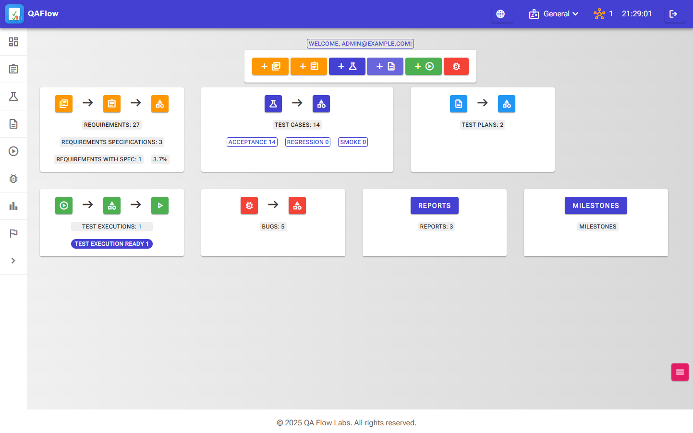

Requirements

This project requires docker engine to be installed and the appropriate dotnet runtime.

It is a fully fledged Test Management tool specially designed to run on the cloud on private servers for maximum security.

Here is an overview 

The main project data  

The strong point which is the test execution engine  
